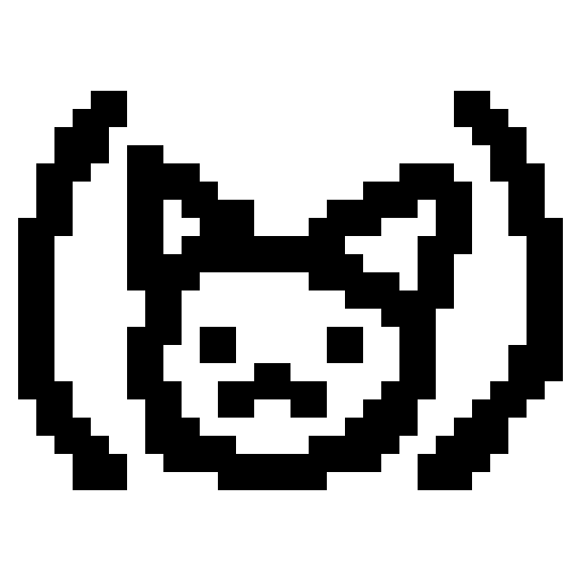

# DrawLisp
A programming language and environment focused on drawing to a digital canvas, similar to [Processing](https://processing.org/) and [p5.js](https://p5js.org/).

[https://oliveisaword.itch.io/drawlisp?secret=YvWD7OeAYr5Go241rtOMFrdbRG8][itch_badge]

[itch_badge]: https://static.itch.io/images/badge-color.svg
